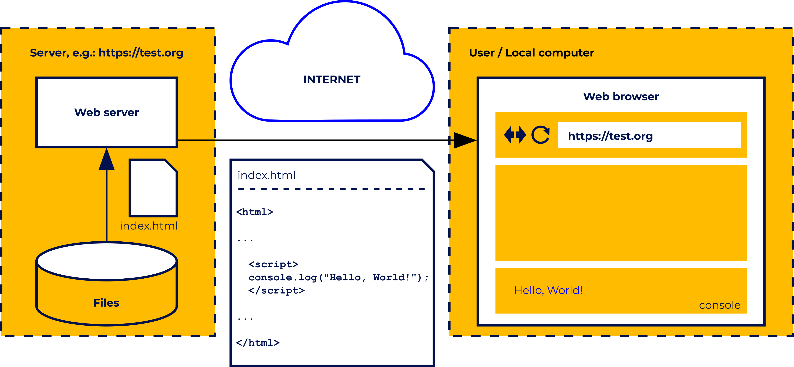

# Curso Javascript

> Anotações do curso [JavaScript Essentials 1](https://www.netacad.com/courses/javascript-essentials-1?courseLang=en-US)

## Escrever informações no console - console.log

Para exibir um conteúdo no terminal se utiliza a função console.log da seguinte maneira:

```
console.log("Hello, World!");
```

O Javascript pode ser utilizados em ecossistemas web e necessita ser anexado em um documento HTML. O Javascript pode ser escrito diretamente no HTML ou pode ser adicionado um ponteiro para a localização do arquivo .js. Essa é uma boa pratica pois o código pode ser muito extenso ou evitar repetição de código em diferentes páginas.



## Variaveis

A nomenclatura de uma variavel possiblita a melhora na identificação do seu conteúdo, onde pode ser utilizada da liberdade para sua definição com a única limitação não iniciar com um dígito e não utilizar palavras reservadas.

Existem dois tipos de variaveis em Javascript: var e let. Uma variavel var possibilta a redeclaração de uma variavel já existente enquano let verifica se uma variavel com o mesmo nome já foi declarada em algum momento.

```
var  height;
var  height;
console.log(height);  //  ->  undefined
```
```
let  height;
let  height;  //  ->  Uncaught  SyntaxError:  Identifier  'height'  has  already  been  declared
console.log(height);
```

```
var  height;
console.log(height);  //  ->  undefined
console.log(weight);  //  ->  Uncaught  ReferenceError:  weight  is  not  defined
```

No exemplo caso uma variavel seja definida sem nenhum valor e seja realizado alguma operação para retorno do seu valor sera apresentado uma mensagem de variavel indefinida.
No mesmo caso não é possível acessar uma variavel que não foi criada.

Para a definição de uma variavel somente é necessário a definição direta ou em um momento posterior:

```
let  height  =  180;
let  anotherHeight  =  height;
let  weight;
console.log(height);  //  ->  180
console.log(anotherHeight);  //  ->  180
weight  =  70;    
console.log(weight);  //  ->  70
```

No exemplo foi instanciado a variavel height já com a definição de seu valor e após isso anotherHeight foi instanciada com o valor recebido de height e weight foi instanciada sem valor definido. Após isso os valores de height e anotherHeight foram acessados pelo console.log confirmando o mesmo valor de ambos e weight recebeu  uma definição de valor e acessado por console.log.

As variaveis são flexiveis com os valores que são guardados em suas instancias, possibilitando a mudança de valores guardados quando é realizado uma nova definição de valor na mesma variavel que sobescreve o valor anterior.

```
let  steps  =  100;
console.log(steps);  //  ->  100
steps  =  120;  //  ->  120
console.log(steps);
steps  =  steps  +  200;
console.log(steps);  //  ->  320
```

No exemplo a variavel steps teve seu valor modificado em diferentes momentos que alteraram o valor guardado anteriormente.

As variaveis em Javascript são tolerantes com o tipo de valor que é guardado em suas variaveis. Os principais tipos são number (números)  e strings (caracteres).

```
let  greeting  =  "Hello!";
let  counter  =  100;
```

A variavel greeting armazena Hello que é uma string e counter guarda o valor 100 que é um number.

```
console.log(greeting);  //  ->  Hello!
greeting  =  1;
console.log(greeting);  //  ->  1
```

Com a flexibilidade das variaveis com os tipos armazenados pode ser modificado o conteudo de uma string para um number sem maiores problemas.

Ocorre tambem a conversão dos valores em certas ações em que diferentes variveis com tipos diferentes interajam entre si:

```
greeting  =  "Hello!";
greeting  =  greeting  +  counter;
console.log(greeting);  //  ->  Hello!100
```

Antes de realizar a concatenação de greeting (string) e counter (number) ele identifica o tipo da variavel greeting e converte counter para o mesmo.

### Constantes

As constantes como as variaveis são utilizadas para armazenamento de variveis, porém necessitam da definição imediata em sua inicialização. A diferença entre constantes e variaveis e que o valor definido em constantes não pode ser modificado de nenhuma maneira direta. Dessa maneira é possível preservar um valor em uma constante sem que ele se perca em algum momento.

```
const  greeting  =  "Hello!";
```

Nesse caso foi instanciado uma constante com nome greeting com uma string "Hello!".

```
const  greeting;  //  ->  Uncaught  SyntaxError:  Missing  initializer  in  const  declaration
greeting  =  "Hello!";
```

Ela não poderia ser instanciada sem um valor definido.

```
const  greeting  =  "Hello!";
greeting  =  "Hi!";  //  ->  Uncaught  TypeError:  Assignment  to  constant  variable.
```

E não poderia ser modificada após instanciada.

### Escopo

O escopo é o alcance de uma determinada variavel presente em um programa. Esse escopo pode ser global ou local dependendo de onde se encontra a definição de uma variável.

```
let  counter;
console.log(counter);  //  ->  undefined
{
         counter  =  1;
         console.log(counter);  //  ->  1
}
counter  =  counter  +  1;
console.log(counter);  //  ->  2
```

A variavel counter e de escopo global, pois o programa pode acessar e interagir com a variavel sem nenhum problema antes do bloco, no bloco e após o bloco.

Essa situação pode ser intensificada na ação de aninhar um bloco dentro de outro:

```
let  counter;
console.log(counter);  //  ->  undefined
{
         counter  =  1;
         {
                 console.log(counter);  //  ->  1
         }
}
counter  =  counter  +  1;
console.log(counter);  //  ->  2
```

Caso uma variavel seja instanciada em um bloco ele será localizada e utilizavel somente dentro desse bloco:

```
let  height  =  180;
{
         let  weight  =  70;
         console.log(height);  //  ->  180
         console.log(weight);  //  ->  70	
}
console.log(height);  //  ->  180
console.log(weight);  //  ->  Uncaught  ReferenceError:  weight  is  not  defined
```

```
let  height  =  200;
{
         let  weight  =  100;
         {
                 let  info  =  "tall";
                 console.log(height);  //  ->  200
                 console.log(weight);  //  ->  100
                 console.log(info);  //  ->  tall
         }
         console.log(height);  //  ->  200
         console.log(weight);  //  ->  100
         console.log(info);  //  ->  Uncaught  ReferenceError:  info  is  not  defined
   }
```

Alguns pontos sobre escopos:
- Variaveis var são sempre globais pois ignoram os blocos.
- Pode ser criada variaveis com o mesmo nome utilizando dos diferentes escopos globais e locais.
- 